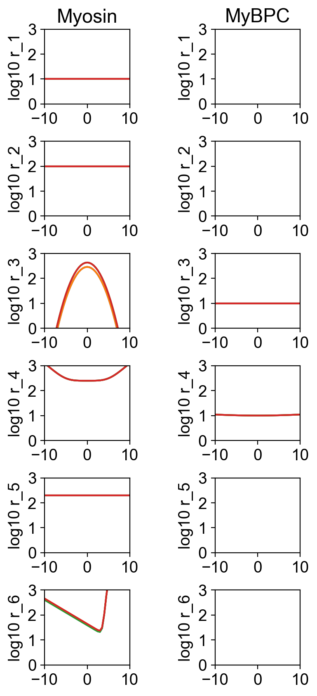
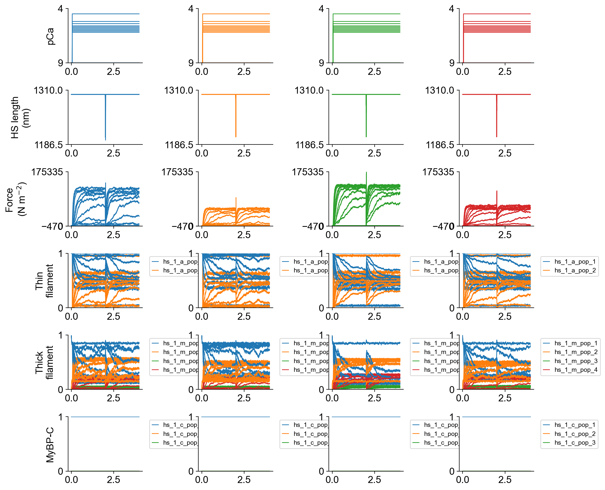
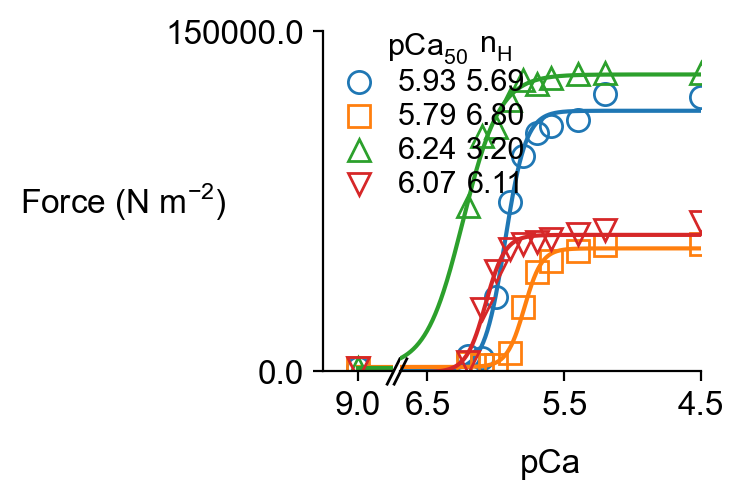
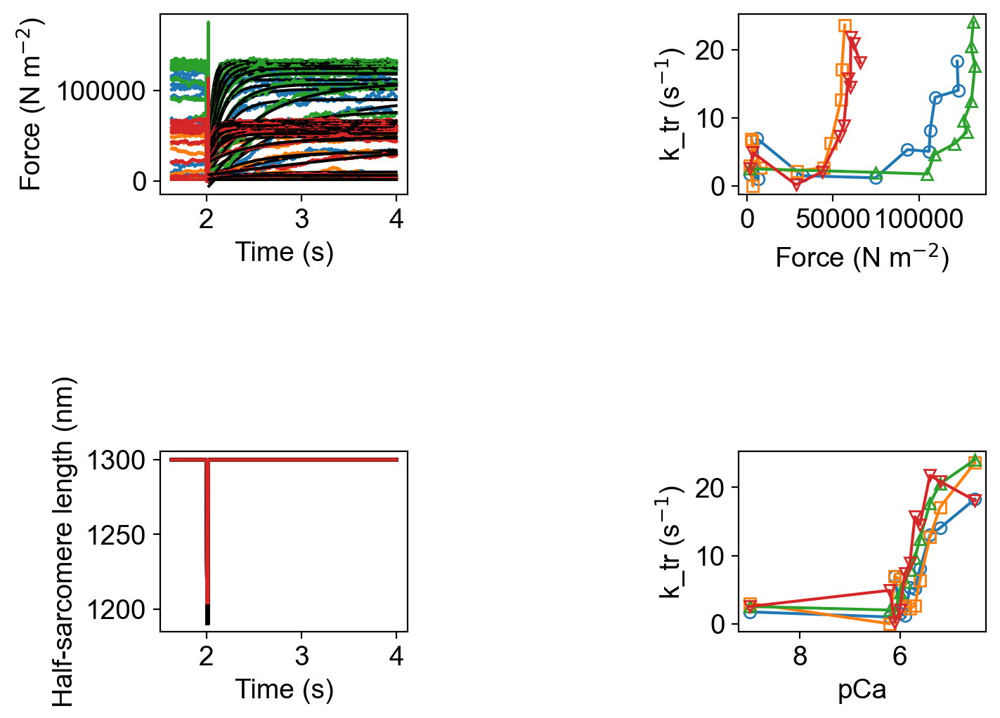
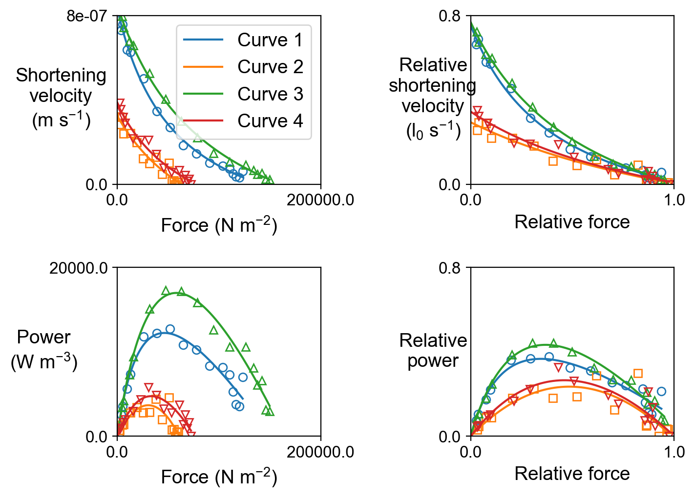
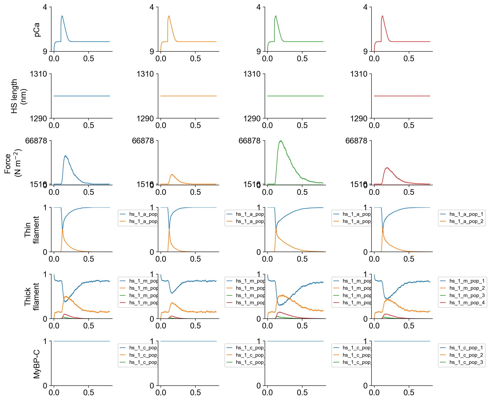

# Readme

## Demo to investigate effects of different myosin effects

### Instructions

+ Pull latest version of [FiberSim](https://campbell-muscle-lab.github.io/FiberSim/)

+ Install FiberSim as described at [https://campbell-muscle-lab.github.io/FiberSim/pages/installation/installation.html](https://campbell-muscle-lab.github.io/FiberSim/pages/installation/installation.html)

+ Pull latest version of [project_greenberg_fibersim](https://github.com/Campbell-Muscle-Lab/project_greenberg_fibersim)

+ Open Anaconda prompt

+ Activate FiberSim environment
  + `conda activate fibersim`

+ Change directory to Fiberpy
  + `cd <FiberSim_Repo>/code/fiberpy/fiberpy`

+ Find the setup file in the project repo
  + `<project_repo>/base/setup.json`

+ Change the `FiberCpp_exe` path to match your FiberSim installation and resave

````
 "FiberSim_setup": {
        "FiberCpp_exe": {
            "relative_to": "False",
            "exe_file": "d:/ken/github/campbellmusclelab/models/FiberSim/bin/FiberCpp.exe"
        },
````

+ Type `python fiberpy.py chararacterize <project_repo>/base/setup.json`

+ Stuff should run

### Output

The setup file runs simulations for different myosin schemes for:
+ force-pCa and k_tr
+ force-velocity at pCa 4.5
+ twitch contractions

There are 4 conditions:
+ 1 = base model
+ 2 = base model with smaller power-stroke distance
+ 3 = base model with faster myosin attachment
+ 4 = base model with smaller power-stroke distance and faster myosin attachment

All the figures are in a folder structure under `<project_repo>/sim_data`

The rate diagram is



Summary files are as follows











### Setup file

The setup file uses features described in the [FiberSim demos](https://campbell-muscle-lab.github.io/FiberSim/pages/demos/demos.html) to run the different simulation conditions.

The cross-bridge scheme is adjusted using the [parameter adjustment mode](https://campbell-muscle-lab.github.io/FiberSim/pages/demos/model_comparison/parameter_adjustments/parameter_adjustments.html)

Note that since the myosin power stroke is embedded inside the functional form of the post-power stroke detachment rate function, one of the detachment parameters has to be adjusted to maintain the kinetics when the power-stroke is adjusted.

You can check this works by looking at the rate figure.

````
{
    "FiberSim_setup": {
        "FiberCpp_exe": {
            "relative_to": "False",
            "exe_file": "d:/ken/github/campbellmusclelab/models/FiberSim/bin/FiberCpp.exe"
        },
        "model": {
            "relative_to": "this_file",
            "options_file": "sim_options.json",
            "manipulations": {
                "base_model": "model.json",
                "generated_folder": "../generated",
                "adjustments": [
                    {
                        "variable": "m_kinetics",
                        "isotype": 1,
                        "state": 4,
                        "extension": 1,
                        "multipliers": [1.0, 0.5, 1.0, 0.5],
                        "output_type": "float"
                    },
                    {
                        "variable": "m_kinetics",
                        "isotype": 1,
                        "state": 4,
                        "transition": 1,
                        "parameter_number": 1,
                        "multipliers": [1.0, 0.5, 1.0, 0.5],
                        "output_type": "float"
                    },
                    {
                        "variable": "m_kinetics",
                        "isotype": 1,
                        "state": 2,
                        "transition": 2,
                        "parameter_number": 1,
                        "multipliers": [1.0, 1.0, 1.5, 1.5],
                        "output_type": "float"
                    }
                ]
            }
        },
        "characterization": [
            {
                "type": "pCa_length_control",
                "relative_to": "this_file",
                "sim_folder": "../sim_data/force_pCa",
                "m_n": 9,
                "randomized_repeats": 1,
                "pCa_values": [9.0, 6.2, 6.1, 6.0, 5.9, 5.8, 5.7, 5.6, 5.4, 5.2, 4.5],
                "sim_duration_s": 4.0,
                "time_step_s": 0.001,
                "pCa_step_up_s": 0.05,
                "k_tr_start_s": 2.0,
                "k_tr_duration_s": 0.02,
                "k_tr_ramp_s": 0.001,
                "k_tr_magnitude_nm": 100,
                "k_tr_fit_time_s": [2.025, 3.995],
                "output_image_formats": [ "png" ],
                "figures_only": "False",
                "trace_figures_on": "False"
            },
            {
                "type": "force_velocity",
                "relative_to": "this_file",
                "sim_folder": "../sim_data/fv_pCa45",
                "pCa": 4.5,
                "hs_lengths": [1100],
                "m_n": 4,
                "randomized_repeats": 1,
                "time_step_s": 0.001,
                "sim_duration_s": 0.6,
                "sim_release_s": 0.5,
                "rel_isotonic_forces": [0.03, 0.04, 0.075, 0.1, 0.2, 0.3, 0.4, 0.5, 0.6, 0.7, 0.8, 0.85, 0.875, 0.9, 0.925, 0.95],
                "fit_time_s": [ 0.51, 0.59 ],
                "output_image_formats": [ "png" ],
                "figures_only": "False",
                "trace_figures_on": "False"
            },
            {
                "type": "twitch",
                "relative_to": "this_file",
                "sim_folder": "../sim_data/twitch",
                "m_n": 16,
                "protocol":
                {
                    "protocol_folder": "../protocols",
                    "data": [
                        {
                            "time_step_s": 0.001,
                            "n_points": 800,
                            "stimulus_times_s": [0.1],
                            "Ca_content": 1e-3,
                            "stimulus_duration_s": 0.02,
                            "k_leak": 1e-3,
                            "k_act": 1,
                            "k_serca": 80
                        }
                    ]
                },
                "output_image_formats": [ "png" ],
                "figures_only": "False",
                "trace_figures_on": "False"
            }
        ]
    }
}
````